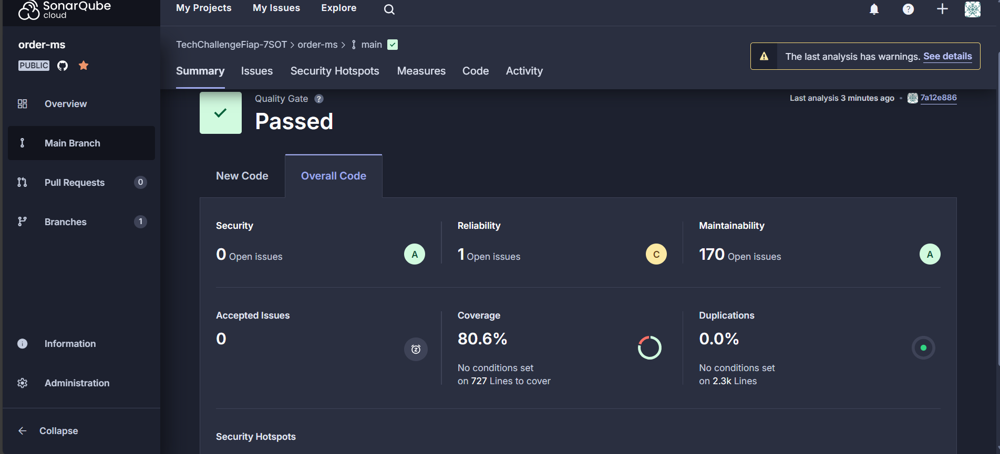

# Análise de Código com SonarCloud

Este projeto utiliza o **SonarCloud** para análise de qualidade de código.

## Relatório SonarCloud

O relatório de análise de código do projeto pode ser acessado diretamente no SonarCloud:

[Visite o SonarCloud para ver o relatório completo](https://sonarcloud.io/summary/overall?id=TechChallengeFiap-7SOT_order-ms)

## Exemplo de Relatório do SonarCloud

Neste exemplo, você pode ver as métricas de qualidade de código, cobertura de testes, bugs, vulnerabilidades e a dívida técnica do projeto. O SonarCloud ajuda a monitorar a qualidade do código durante o desenvolvimento e a melhorar continuamente os padrões do projeto.
